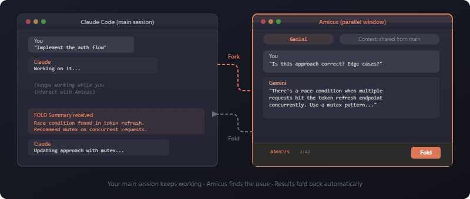

<div align="center">

# Amicus

**A multi-model LLM Council for Claude — with a parallel AI window underneath.**


Hand Claude a plan, a design, a diff, an architecture decision, a manuscript — anything — and say *council review this*: Amicus routes it through several models from different families, has them anonymously cross-review each other, and a non-Claude chair synthesizes a verdict you turn into accept/deny edits. Or skip the ceremony and **fork** a single conversation to Gemini, GPT, DeepSeek, or any other model — it works in parallel with full context, and you **fold** the result back when you're ready. Claude orchestrates throughout; you stay in your editor.

[](https://www.npmjs.com/package/amicus)
[](./LICENSE)
[](https://nodejs.org)
[](./CONTRIBUTING.md)

> **Supported clients:** Claude Code CLI and Claude Cowork are fully tested and supported. Claude Code web and Claude Desktop are experimental.

</div>

---

## Table of Contents

- [What is Amicus](#what-is-amicus)
- [Quick start](#quick-start)
- [Requirements & Dependencies](#requirements--dependencies)
- [The Council](#the-council)
- [The parallel window](#the-parallel-window)
- [Commands](#commands)
- [Models](#models)
- [MCP integration](#mcp-integration)
- [Configuration](#configuration)
- [JSON output](#json-output)
- [Windows](#windows)
- [Troubleshooting](#troubleshooting)
- [Documentation](#documentation)
- [Contributing](#contributing)
- [Built on OpenCode](#built-on-opencode)
- [Attribution & License](#attribution--license)

---

## What is Amicus

One install delivers four things that work together:

- **The `second-opinion` LLM Council skill.** Structured multi-model review: independent reviews → anonymized peer cross-review → a non-Claude chair verdict → tiered accept/deny decisions. This is the hero.
- **The `sidecar` chat skill.** Ad-hoc fork/work/fold — spin up one other model in a real window (or headless), work alongside it, fold the summary back.
- **The `amicus` CLI (with an `am` alias) and an MCP server.** The engine underneath both skills: launches sessions, shares context, runs parallel waves, and exposes the same surface to Claude as MCP tools.
- **A self-updating model catalog.** Aliases and validation resolve against a live catalog fetched from provider APIs (cached locally), so model names stay current without a hard-coded table.

Claude is the orchestrator. The council and chat skills run *on top of* the engine; you talk to Claude, and Claude drives Amicus.



---

## Quick start

**Install** — pick whichever fits; all deliver the same CLI, MCP server, and both skills:

**As a Claude Code plugin** — the most native path if you use Claude Code:

```text
/plugin marketplace add BourbonDog/amicus
/plugin install amicus@bourbondog-amicus
/reload-plugins
```

Claude Code registers the MCP server and both skills for you — nothing to configure. (The standalone Electron window is npm-only, and the first council/sidecar call downloads the OpenCode engine.)

**With the install script** — macOS, Linux, or Windows (needs [Node.js](https://nodejs.org) ≥ 18):

```bash
# macOS / Linux
curl -fsSL https://raw.githubusercontent.com/BourbonDog/amicus/main/install.sh | sh
```

```powershell
# Windows (PowerShell)
irm https://raw.githubusercontent.com/BourbonDog/amicus/main/install.ps1 | iex
```

**With npm** — the canonical path (needs [Node.js](https://nodejs.org) ≥ 18):

```bash
npm install -g amicus
```

For the **npm** and **install-script** paths, a postinstall auto-configures everything — no manual registration:

- Registers the **MCP server** in Claude Code and in Claude Desktop / Cowork, so the Amicus tools appear natively.
- Installs **both skills** into `~/.claude/skills/` — `second-opinion` (the council) and `sidecar` (the chat skill).

**Configure:**

```bash
amicus setup
```

This opens a graphical wizard:

| Step | What it does |
|------|--------------|
| **1. API Keys** | Enter keys for OpenRouter, Google, OpenAI, Anthropic, and/or DeepSeek. Each is validated live against the provider's API. Written to `~/.config/amicus/.env` with `0600` permissions. |
| **2. Default Model** | Pick your go-to model from a searchable live picker (backed by the catalog). Used whenever you omit `--model`. |
| **3. Model Routing** | Decide which provider serves each model — e.g. route Gemini through a direct Google key and everything else through OpenRouter. |
| **4. Review** | Confirm the configuration before saving. |

> **Headless environments:** if Electron can't open a window, the wizard falls back to a readline-based setup in the terminal.

**Your first council** — no flags to learn. In Claude Code or Cowork, give Claude a document and say:

> *council review this*

Claude prepares the material, recommends a bench of models, discloses the run shape and cost, and orchestrates the rest. You make the accept/deny calls at the end. (The `second-opinion` skill installed in the previous step is what teaches Claude to recognize this — if nothing happens, confirm it landed in `~/.claude/skills/second-opinion/`.)

**Your first sidecar.** The sidecar is the lower-level path — you can invoke it by phrase through Claude too, but the CLI gives you the flags directly:

```bash
amicus start --model gemini --prompt "Fact-check the auth approach Claude just proposed"
```

A window opens alongside your editor with Gemini ready, pre-loaded with your conversation. Work with it, then **Fold** the summary back.

### Install from GitHub

The npm package is the primary path. To install straight from the repo instead — the postinstall runs **identically** (same MCP registration, same two skills) — you just need `git` on your `PATH`:

```bash
npm install -g github:BourbonDog/amicus
```

See [Requirements & Dependencies](#requirements--dependencies) for the full prerequisite list.

### Contributor setup

Cloning to develop Amicus? See **[CONTRIBUTING.md](./CONTRIBUTING.md)** for the dev setup, git-hook wiring, and test commands.

---

## Requirements & Dependencies

Everything you need before your first run, and what's optional.

**Runtime**

- **Node.js ≥ 18** — `node --version` to check. This is the only hard runtime prerequisite.
- **An active Claude Code or Cowork session** — Amicus is orchestrated by Claude; it is not a standalone chatbot.

**Install path & the git toolchain**

- **From the npm registry (recommended):** `npm install -g amicus`. No build toolchain required — the package ships prebuilt.
- **From GitHub:** `npm install -g github:BourbonDog/amicus` runs **identically** — same MCP registration, same two skills, same postinstall. The one extra requirement is a working **git** on your `PATH`, since npm clones the repo to install it (`git --version` to check).

**Model API keys** — at least one is required

- **OpenRouter** covers the most models with one key, or use a **direct Google / OpenAI / Anthropic / DeepSeek** key. Add one with `amicus setup` or `amicus key <provider> <key>`; keys live in `~/.config/amicus/.env`. The supported env vars are `OPENROUTER_API_KEY`, `GOOGLE_GENERATIVE_AI_API_KEY` (the legacy `GEMINI_API_KEY` is still accepted), `OPENAI_API_KEY`, `ANTHROPIC_API_KEY`, and `DEEPSEEK_API_KEY`.
- ⚠️ **OpenRouter keys need purchased credits.** A brand-new, zero-credit key *passes* setup's live validation but then fails at runtime with a **402** on the first real call. Buy a small amount of credit before you run a council.

**Electron — optional (GUI only)**

- Electron is an **optional** dependency. It powers the graphical setup wizard and the parallel sidecar window. **Headless runs and the full council work without it** — if Electron is absent or can't open a window, `amicus setup` falls back to a readline wizard and sidecars run headless. `amicus doctor` reports Electron's presence accurately and never treats its absence as fatal.

**The OpenCode engine**

- The bundled **`opencode-ai`** engine (the conversation runtime) installs automatically as a normal dependency — you don't install it separately. Its own postinstall lays down ~11 per-platform binaries; a **transient** failure there (a spawn `ENOENT`, or an antivirus file-lock) can roll back the atomic install. If install fails partway or `amicus doctor` reports the OpenCode binary "not found", just **re-run** `npm install -g amicus` (clear the cache first if it persists: `npm cache clean --force`).

**OS support**

- **Windows 11, macOS, and Linux** are all supported; Amicus is first-class on **Windows** (developed and tested there, no WSL required). See the [Windows](#windows) section for platform specifics.

**What a run costs.** A sidecar is a single model call. A full council is typically **~5–8 paid model calls** (e.g. 3 reviewers across 2 fan-out waves + 1 chair). Amicus shows an estimate before each council and enforces a built-in budget gate that refuses ultra-expensive models (o3-pro class) unless you opt in with `--no-cost-gate`. You pay your providers directly for the tokens; Amicus itself is free and open-source.

---

## The Council

**Why multi-model.** Any single model — including the one running your session — has consistent blind spots. Route the *same* material through models from *different* families and the disagreements surface: missed issues, overstated confidence, claims one model alone would have waved through. The council is the structured version of that idea.

**The flow, in five beats:**

1. **Independent reviews.** Each council model reviews the artifact on its own (one parallel wave), producing a structured findings list — claim, severity (`blocker | major | minor | nit`), location, rationale.
2. **Anonymized cross-review.** Claude relabels every review (Review A, B, C…) and sends the identical bundle to every model. Each model ranks the reviews and adjudicates every finding (`agree | dispute | neutral`) — *unknowingly judging its own*, so self-bias washes out. This yields a **street-cred** ranking and sorts findings into **Confirmed / Contested / Singleton** tiers.
3. **Chair verdict.** A designated **non-Claude** chair receives the de-anonymized picture — all reviews, rankings, and adjudications — and synthesizes an independent verdict. Claude presents it verbatim; Claude does not synthesize.
4. **Tiered decisions.** Confirmed findings get one bulk accept/deny; Contested and Singleton findings are decided one at a time (accept / deny / modify).
5. **Outputs applied.** Accepted findings are written into a reviewed copy of the source; the full run is captured in the run folder.

**What a run produces** (in `output/<stem>-council/`):

- `review-<model>.md` × N — each model's independent review.
- `crossreview-matrix.md` — the adjudication grid plus the de-anonymized street-cred table.
- `verdict.md` — the chair's synthesis.
- `report.md` — synthesis + the full decision log + a per-call run-stats table.
- For an **editable source**, the accepted edits land in `<stem>-reviewed.<ext>` next to the original.

**Claude in the council** (default off): you can add Claude's own fresh review to the bundle so the bench ranks and adjudicates it — Claude is *judged* but never votes or chairs, so the verdict stays independent.

**Cost is disclosed up front.** Before any model launches, you see the run shape — for example:

> This run uses 3 council models across 2 fanout waves + 1 chair call (~7 model runs).

Then the council waits for your confirmation.

The skill lives at **[`skills/second-opinion/SKILL.md`](./skills/second-opinion/SKILL.md)**; the design spec behind it is **[`skills/second-opinion/COUNCIL-DESIGN.md`](./skills/second-opinion/COUNCIL-DESIGN.md)**.

**Free council (zero-cost).** Want the cross-examination without the model spend? `amicus setup` offers a **Free OpenRouter council** mode — readline wizard option 2, and the Electron **Models** step. It detects the free `:free` models live from the catalog, lets you multi-pick (Enter takes a vendor-diverse default), and saves them as `councils.free` — a first-class `councils` config primitive seeded under collision-safe `free-*` aliases. Your `config.default` is left untouched, and all you need is an `OPENROUTER_API_KEY`.

Run it anywhere a council runs:

```bash
amicus fanout --council free --prompt "Review this design"
```

The `amicus_fanout` MCP tool takes the same `council` parameter, and the `second-opinion` skill reads `councils.free` automatically. A member that gets delisted is dropped with a warning — the council still runs as long as ≥2 survive. Free models are **rate-limited and quality-variable**, and some return 404 unless you enable data-sharing at [openrouter.ai/settings/privacy](https://openrouter.ai/settings/privacy).

---

## The parallel window

When you don't need a full council — just one other model's take — fork a conversation. Amicus extracts your current Claude Code context, opens a session pre-loaded with it, you **work** alongside it, and you **fold** a structured summary back into Claude's context when you're done.

**Interactive (default):** a real window opens next to your editor. Switch models mid-conversation with the model switcher, then click the **FOLD** button (or press `Cmd+Shift+F`) to generate the summary. Customize the shortcut with `--fold-shortcut`.

**Headless (`--no-ui`):** the agent works autonomously and emits the fold summary when it finishes — ideal for bulk work like test generation or documentation. Pair with `--json` for a machine-readable run document.

**Context sharing.** Your conversation history is passed automatically. Tune it:

- `--context-turns <N>` — max conversation turns to include (default 50).
- `--context-since <duration>` — time window (e.g. `2h`); overrides turns.
- `--context-max-tokens <N>` — cap the context size (default 80000).
- `--no-context` — skip parent history entirely.

**MCP inheritance.** Amicus discovers the MCP servers your Claude Code session uses and passes them through, so the forked model has the same tools you do. Control it:

- `--no-mcp` — don't inherit any parent MCP servers.
- `--exclude-mcp <name>` — drop a specific server (repeatable).
- `--mcp <name=url|name=command>` — add one.

**Safety.** Amicus warns on **file conflicts** (a file changed externally while the session ran) and on **context drift** (the shared context may be stale relative to your current session), so a fold never silently overwrites newer work.

**Auto-update.** Amicus checks the npm registry at most once every 24 hours (cached background check). When an update exists, the CLI prints a notice and the Electron toolbar shows a one-click **Update** banner. Or run it yourself:

```bash
amicus update
```


---

## Commands

| Command | What it does |
|---------|--------------|
| `amicus start` | Launch a new session (interactive or `--no-ui`). |
| `amicus fanout` | Run N models on the same prompt in parallel (headless). |
| `amicus list` | Show previous sessions. |
| `amicus resume` | Reopen a previous session with full history. |
| `amicus continue` | Start a new session building on a previous one. |
| `amicus read` | Output a session's summary / conversation / metadata. |
| `amicus status <id>` | One-shot status for a session or fan-out wave (human or `--json`; `--wave <id>` alternative spelling). |
| `amicus models` | List, search, refresh the catalog, or audit aliases. |
| `amicus abort` | Abort a running session (or `--all`). |
| `amicus setup` | Configure default model, API keys, and aliases. |
| `amicus update` | Update to the latest version. |
| `amicus mcp` | Start the MCP server (stdio transport). |

The `am` alias is interchangeable with `amicus` everywhere.

### `amicus start` options

| Option | Description | Default |
|--------|-------------|---------|
| `--model <model>` | Alias, `provider/model`, or `openrouter/provider/model`. | config default |
| `--prompt <text>` | Task description. | *(required unless `--prompt-file`)* |
| `--prompt-file <path>` | Read the prompt from a UTF-8 file (XOR `--prompt`). | |
| `--agent <agent>` | OpenCode agent: `Chat`, `Build`, `Plan`. | `Chat` interactive / `Build` headless |
| `--no-ui` | Run headless (autonomous, no window). | off |
| `--json` | Emit the run result as stable JSON (requires `--no-ui`). | off |
| `--timeout <minutes>` | Headless timeout. | 15 |
| `--context-turns <N>` | Max conversation turns to include. | 50 |
| `--context-since <duration>` | Time filter (e.g. `2h`); overrides turns. | |
| `--context-max-tokens <N>` | Max context tokens. | 80000 |
| `--no-context` | Skip parent conversation history. | off |
| `--thinking <level>` | Reasoning effort: `none`, `minimal`, `low`, `medium`, `high`, `xhigh`. | model default |
| `--summary-length <length>` | Fold summary verbosity: `brief`, `normal`, `verbose`. | `normal` |
| `--mcp <spec>` | Add an MCP server (`name=url` or `name=command`). | |
| `--mcp-config <path>` | Path to an `opencode.json` with MCP config. | |
| `--no-mcp` | Don't inherit MCP servers from the parent. | off |
| `--exclude-mcp <name>` | Exclude a specific inherited MCP server (repeatable). | |
| `--session-id <id\|current>` | Session to pull context from. | `current` |
| `--cwd <path>` | Project directory. | cwd |
| `--client <type>` | Client context: `code-local`, `code-web`, `cowork`. | `code-local` |
| `--position <pos>` | Window position: `right`, `left`, `center`. | `right` |
| `--fold-shortcut <key>` | Customize the fold keyboard shortcut. | `Cmd/Ctrl+Shift+F` |
| `--opencode-port <port>` | Port override for the OpenCode server. | |
| `--session-dir <path>` | Explicit session-data directory. | |
| `--setup` | Force-open configuration before launching. | |
| `--no-validate-model` | Skip model-catalog validation before launch. | validation on |

> Agents: **Chat** auto-approves reads and asks before writes/bash (interactive default); **Build** has full tool access (headless default); **Plan** is read-only analysis. `--agent Chat` is interactive-only and incompatible with `--no-ui`.

### `amicus fanout` — same prompt, many models

```bash
amicus fanout --models gemini,deepseek,gpt --prompt "Review this design" --json
```

Fanout runs one **headless wave**: every leg gets the **same** prompt (this is the shared-prompt model the council's review stages are built on). When all legs are terminal it prints **one** JSON wave document on stdout.

- `--models <a,b,c>` — comma-separated aliases or `provider/model` IDs (required, unless `--council`).
- `--council <name>` — run a saved council (e.g. `free`) instead of `--models`; mutually exclusive with `--models`.
- `--prompt <text>` / `--prompt-file <path>` — the shared briefing. `--prompt-file` avoids the ~32 KB Windows argument cap and is mutually exclusive with `--prompt`.
- `--wave-id <id>` — set the wave ID explicitly (leg IDs become `<id>-1..N`).
- `--json` — emit the wave document.
- Shared per-leg knobs: `--agent`, `--thinking`, `--timeout`, `--summary-length`, `--no-context`, the `--context-*` flags, the `--mcp*` flags, `--no-validate-model`, `--cwd`.
- **Exit codes:** `0` all legs complete, `2` partial wave, `1` none complete / hard failure.

### Other commands

```bash
amicus list                          # current project
amicus list --status running         # filter by status (running, complete)
amicus list --all                    # all projects
amicus list --json                   # machine-readable

amicus read <id>                     # summary (default)
amicus read <id> --conversation      # full conversation
amicus read <id> --metadata          # session metadata
amicus read <id> --json              # stable JSON (run or wave document)

amicus status <id>                   # one-shot status for a session or wave
amicus status --wave <id>            # alternative spelling for a wave ID
amicus status <id> --json            # machine-readable output

amicus resume <id>                   # reopen with full history
amicus continue <id> --prompt "..."  # new session, previous one as read-only context

amicus abort <id>                    # stop one running session
amicus abort --all                   # stop all running sessions in this project

amicus setup --api-keys              # open just the API-key window
amicus setup --add-alias fast=openrouter/google/gemini-2.5-flash   # add/override one alias
```

---

## Models

Amicus does **not** ship a frozen table of model names. Aliases and validation resolve against a **live catalog** fetched from provider APIs and cached at `~/.config/amicus/model-catalog.json` (24-hour TTL; the fetch works without an API key).

```bash
amicus models                 # list the catalog
amicus models --search gemini # filter by substring over id and name
amicus models --refresh       # force-refresh from provider APIs
amicus models --check         # audit your aliases against the catalog
```

`amicus models --check` exits with the **number of stale aliases** (capped at 100) and prints same-vendor replacement suggestions for each, so it drops cleanly into CI.

**Validation on launch.** `start` and `fanout` validate the model against the catalog before launching. For an explicit `--model` on `continue`/`resume` this is **blocking** (a typo'd model fails fast with suggestions); for a model *inherited* from a prior session it's **advisory**. Skip it any time with `--no-validate-model`, or fix the catalog with `amicus models --refresh`.

**Aliases are a curated seed, not a fixed list.** `amicus setup` seeds a curated set of short aliases (e.g. `gemini`, `gpt`, `opus`, `deepseek`), and you add or override them with `amicus setup --add-alias name=provider/model`. To see exactly what resolves on *your* machine, run `amicus models` — that is the source of truth, not this README.

**Full-id passthrough.** You can always bypass aliases and name a model directly. The prefix decides which credentials are used:

| Format | Example | Credentials |
|--------|---------|-------------|
| `openrouter/provider/model` | `openrouter/google/gemini-2.5-flash` | `OPENROUTER_API_KEY` |
| `google/model` | `google/gemini-2.5-flash` | `GOOGLE_GENERATIVE_AI_API_KEY` |
| `openai/model` | `openai/gpt-5` | `OPENAI_API_KEY` |
| `anthropic/model` | `anthropic/claude-opus-4` (the `opus` alias resolves here by default) | `ANTHROPIC_API_KEY` |

---

## MCP integration

The MCP server is auto-registered on install (Claude Code and Claude Desktop / Cowork). It exposes fourteen tools:

| Tool | What it does |
|------|--------------|
| `amicus_start` | Spawn a session; returns a task ID immediately. |
| `amicus_status` | Poll a task (or a fanout wave) for completion. |
| `amicus_wait` | Block inside one tool call until a session/wave finishes or the wait window closes. |
| `amicus_read` | Read results: summary, conversation, metadata, or JSON. |
| `amicus_list` | List past sessions. |
| `amicus_resume` | Reopen a session. |
| `amicus_continue` | New session building on a previous one. |
| `amicus_abort` | Stop a running session. |
| `amicus_setup` | Open the setup wizard. |
| `amicus_guide` | Return usage guidance (model choice, briefings, polling). |
| `amicus_fanout` | Launch a same-prompt wave; returns `{ waveId, taskIds[] }`. |
| `amicus_council_tally` | Aggregate a council wave's reviews into a scored tally. |
| `amicus_council_stats` | Reviewer-reliability stats from past council runs. |
| `amicus_verdict` | Build the final council verdict from a tally + decisions. |

The async pattern is **start → status → read**: `amicus_start` (or `amicus_fanout`) returns immediately, you poll `amicus_status`, then `amicus_read` once it's done — so the calling agent never blocks. Prefer `amicus_wait` over manual sleep+status polling for headless runs: it collapses the poll loop into a single blocking call that returns as soon as the run finishes (or the wait window closes).

To register manually (user scope):

```bash
claude mcp add-json amicus '{"command":"npx","args":["-y","amicus@latest","mcp"]}' --scope user
```

> Legacy `sidecar_*` tool names are no longer registered by default (v1.8.0). To restore them, add `"env": {"AMICUS_LEGACY_ALIASES": "1"}` to the server entry. They will be removed entirely in the next major.

---

## Configuration

`amicus setup` is the recommended way to configure Amicus — it writes API keys to `~/.config/amicus/.env` (`0600`) and persists your default model and aliases. The environment variables below are for overrides and tuning. Dev-only variables (mock/update testing) are documented in [docs/configuration.md](./docs/configuration.md).

**API keys**

| Variable | Purpose |
|----------|---------|
| `OPENROUTER_API_KEY` | OpenRouter (multi-provider access). |
| `GOOGLE_GENERATIVE_AI_API_KEY` | Direct Google access. |
| `OPENAI_API_KEY` | Direct OpenAI access. |
| `ANTHROPIC_API_KEY` | Direct Anthropic access. |
| `DEEPSEEK_API_KEY` | Direct DeepSeek access. |

**Behavior**

| Variable | Purpose | Default |
|----------|---------|---------|
| `LOG_LEVEL` | Log verbosity: `error`, `warn`, `info`, `debug`. | `error` |
| `AMICUS_CONFIG_DIR` | Override the config directory (keys, catalog, sessions). | `~/.config/amicus` |
| `AMICUS_FANOUT_MAX_LEGS` | Cap the number of legs in a single fanout wave; non-positive values fall back to 10. | `10` |
| `AMICUS_SHARED_SERVER` | When `1`, multiple MCP sessions share a single OpenCode Go process, eliminating cold-start latency. Set to `0` for per-process isolation or to diagnose a crash loop. | `1` |

**Headless poller tuning** (advanced — rarely needed)

| Variable | Purpose | Default |
|----------|---------|---------|
| `AMICUS_POLL_INTERVAL_MS` | Delay between poll cycles. | `2000` |
| `AMICUS_POLL_CALL_TIMEOUT_MS` | Per-poll call timeout. | `30000` |
| `AMICUS_STABLE_FINISHED_POLLS` | Stable polls required after a completion signal. | `2` |
| `AMICUS_STABLE_IDLE_POLLS` | Stable polls required with no completion signal (~60 s at 2 s). | `30` |
| `AMICUS_MAX_CONSECUTIVE_POLL_FAILURES` | Consecutive poll failures before bailing. | `15` |

**GUI & debug**

| Variable | Purpose | Default |
|----------|---------|---------|
| `AMICUS_GUI_LOAD_TIMEOUT_MS` | Max wait for the Electron UI to load before showing what's in flight. | `15000` |
| `AMICUS_DEBUG_PORT` | Chrome DevTools Protocol port for the Electron window. | `9222` |

> **Legacy names.** The pre-rebrand `SIDECAR_*` environment variables are still honored (with a one-time deprecation warning) and map to their `AMICUS_*` equivalents. See **[docs/SHIMS.md](./docs/SHIMS.md)** for the full mapping.

---

## JSON output

With `--json`, Amicus emits stable, versioned documents on stdout — built for scripting and agent consumption.

**Run document** (a single session — `start`, `read`, each fanout leg):

```json
{
  "taskId": "...", "model": "...", "modelInput": "...", "agent": "...",
  "status": "complete", "summary": "...", "error": null,
  "createdAt": "...", "completedAt": "...", "durationMs": 0
}
```

`modelInput` is the alias you passed; `model` is the resolved id. `status` is one of `complete | error | timeout | aborted` (plus `crashed` / `idle-timeout`); `summary` carries the fold output.

**Wave document** (`fanout`, and `read <waveId> --json`):

```json
{
  "schemaVersion": 1, "waveId": "...",
  "status": "complete",
  "counts": { "total": 0, "complete": 0, "error": 0, "timeout": 0, "aborted": 0 },
  "legs": [ /* one run document per model, in --models order */ ]
}
```

`status` is `complete | partial | error | aborted`. A leg's `summary` is that model's full response.

**Exit codes** (for `--no-ui` / `fanout`): `0` success / all legs complete · `2` partial wave · `1` error, nothing completed, or hard failure · `130` interrupted (SIGINT) · `143` terminated (SIGTERM).

---

## Windows

Amicus is **first-class on Windows** — developed and tested on Windows 11, no WSL required.

Most Claude-adjacent tooling assumes macOS/Linux; Amicus doesn't.

- The full unit suite runs green on Windows 11.
- Native-binary PATH handling resolves the OpenCode binary correctly under Windows.
- Session-path encoding is handled natively (the Claude project-path encoding that trips up naive `~/.claude/projects` lookups is accounted for).
- For long briefings, `--prompt-file` sidesteps the ~32 KB Windows command-line argument cap.

---

## Troubleshooting

| Symptom | Likely cause | Fix |
|---------|--------------|-----|
| "council review this" does nothing | The `second-opinion` skill isn't installed | Check `~/.claude/skills/second-opinion/SKILL.md` exists; re-run `npm install -g amicus` (postinstall installs both skills) |
| `npm install -g amicus` fails with `EEXIST: … claude-sidecar` | The old upstream `claude-sidecar` package is still installed globally; npm won't overwrite another package's bin shims | `npm uninstall -g claude-sidecar`, then `npm install -g amicus`. Your config and sessions carry over (legacy paths are still read). |
| Install fails partway, or `amicus doctor` reports the OpenCode binary "not found" | A **transient** error during the OpenCode engine's own postinstall (a spawn `ENOENT`, or an antivirus file-lock while it lays down its 11 per-platform binaries) can roll back the whole atomic install — retrying usually succeeds | Just re-run `npm install -g amicus`. If it still fails, clear the cache first: `npm cache clean --force && npm install -g amicus`. |
| `401` / auth error | API key missing, or the model prefix doesn't match the key you have | Run `amicus setup`; make sure the prefix (`openrouter/…` vs `google/…` vs `openai/…` vs `anthropic/…`) matches the credentials you configured. |
| Session not found | No session matches the given ID | Run `amicus list`, or omit `--session-id` to use the most recent. |
| No conversation history found | Project-path encoding | Check `~/.claude/projects/`; `/` and `_` in the project path are encoded as `-` in the directory name. |
| Headless run never finishes | Task is bigger than the default timeout | Raise it: `--timeout 30`. |
| Wrong session picked up | Multiple active sessions resolve ambiguously | Pass `--session-id` explicitly. |
| Fold summary looks corrupted | Debug output leaking into stdout | Re-run with `LOG_LEVEL=debug` to see what's printing. |
| Model fails catalog validation | The model isn't in the cached catalog (renamed, or cache stale) | `amicus models --refresh`, or bypass with `--no-validate-model`. |
| `fanout` exits `2` | Partial wave — at least one leg failed | Read the wave document's `legs[]` and inspect each failed leg's `status` / `error`. |

**Debug logging:**

```bash
LOG_LEVEL=debug amicus start --model gemini --prompt "test" --no-ui
```

---

## Documentation

| Doc | Description |
|-----|-------------|
| [docs/usage.md](./docs/usage.md) | Command-by-command usage guide. |
| [docs/configuration.md](./docs/configuration.md) | Full configuration and environment reference. |
| [docs/architecture.md](./docs/architecture.md) | How the engine, Electron shell, and context sharing fit together. |
| [docs/opencode-integration.md](./docs/opencode-integration.md) | How Amicus drives the OpenCode runtime. |
| [docs/troubleshooting.md](./docs/troubleshooting.md) | Extended troubleshooting. |
| [docs/electron-testing.md](./docs/electron-testing.md) | Chrome DevTools Protocol patterns for UI testing. |
| [docs/testing.md](./docs/testing.md) | Test suite layout and how to run it. |
| [docs/publishing.md](./docs/publishing.md) | Release and publish process. |
| [docs/SHIMS.md](./docs/SHIMS.md) | Legacy `SIDECAR_*` → `AMICUS_*` compatibility shims. |
| [skills/second-opinion/SKILL.md](./skills/second-opinion/SKILL.md) | The LLM Council skill. |
| [skills/sidecar/SKILL.md](./skills/sidecar/SKILL.md) | The `sidecar` chat skill. |
| [evals/README.md](./evals/README.md) | End-to-end eval harness for LLM interactions. |

---

## Contributing

Contributions are welcome. The dev setup, git-hook wiring, and test commands live in **[CONTRIBUTING.md](./CONTRIBUTING.md)**.

The autonomous Electron-UI testing approach (driving the real window over the Chrome DevTools Protocol) is documented in **[docs/electron-testing.md](./docs/electron-testing.md)**.

---

## Built on OpenCode

Amicus is a harness built on top of [**OpenCode**](https://opencode.ai), the open-source AI coding engine. OpenCode provides the conversation runtime, tool-execution framework, agent system, and web UI. Amicus adds context sharing from Claude Code, the Electron shell, the fold/summary workflow, session persistence, parallel fanout waves, the multi-model council, and multi-client support (CLI, MCP, Cowork). OpenCode handles the hard parts of LLM interaction so Amicus can focus on the council-and-parallel-window workflow.

---

## Attribution & License

Amicus is inspired by [**Claude Sidecar**](https://github.com/jrenaldi79/sidecar) by [John Renaldi](https://github.com/jrenaldi79), used under the MIT License. The original copyright (© 2025 John Renaldi) is preserved in full in [LICENSE](./LICENSE). The engine modifications, the multi-model council, and the skill bundling are © 2026 Christian Wagner, also under the MIT License. See [LICENSE](./LICENSE) and [NOTICE](./NOTICE) for the complete attribution.

**MIT.**
