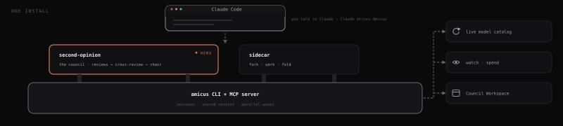
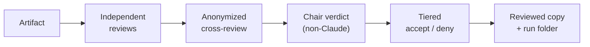
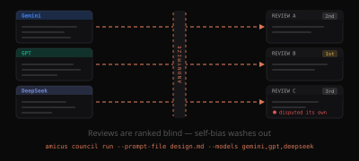
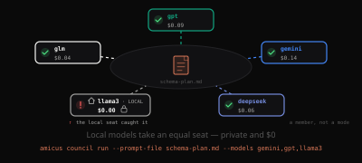

<div align="center">

# Amicus

**A multi-model LLM Council for Claude — with a parallel AI window underneath.**

<p align="center"></p>

Hand Claude a plan, a design, a diff, an architecture decision, a manuscript — anything — and say *council review this*: Amicus routes it through several models from different families, has them anonymously cross-review each other, and a non-Claude chair synthesizes a verdict you turn into accept/deny edits. Or skip the ceremony and **fork** a single conversation to Gemini, GPT, DeepSeek, or any other model — it works in parallel with full context, and you **fold** the result back when you're ready. Claude orchestrates throughout; you stay in your editor.

**The same council — more ways to run it:** take it **headless in CI** with no Claude runtime, sharpen it with a **debate round**, or run it on **free local models** (Ollama, LM Studio, vLLM) at **$0** — private and offline.

[](https://www.npmjs.com/package/amicus)
[](./LICENSE)
[](https://nodejs.org)
[](./CONTRIBUTING.md)

**[Quick start ↓](#quick-start)** · [Commands](#commands) · [Documentation](#documentation) · [Troubleshooting](#troubleshooting)

> **Supported clients:** Claude Code CLI, Claude Desktop, and Claude Cowork are fully tested and supported. Claude Code web is experimental.

</div>

---

## Table of Contents

- [What is Amicus](#what-is-amicus)
- [The Council](#the-council)
- [Ways to run the council](#ways-to-run-the-council)
- [Quick start](#quick-start)
  - [1. Install](#1-install)
  - [**2. Configure — don't skip this**](#2-configure--dont-skip-this)
  - [3. Your first council](#3-your-first-council)
  - [4. Your first sidecar](#4-your-first-sidecar)
- [Requirements & Dependencies](#requirements--dependencies)
- [The parallel window](#the-parallel-window)
- [Commands](#commands)
- [Models](#models)
- [MCP integration](#mcp-integration)
- [Configuration](#configuration)
- [JSON output](#json-output)
- [Windows](#windows)
- [Troubleshooting](#troubleshooting)
- [Documentation](#documentation)
- [Contributing](#contributing)
- [Built on OpenCode](#built-on-opencode)
- [Attribution & License](#attribution--license)

---

## What is Amicus

One install delivers six things that work together:

- **The `second-opinion` LLM Council skill.** Structured multi-model review: independent reviews → anonymized peer cross-review → a non-Claude chair verdict → tiered accept/deny decisions. This is the hero.
- **The `sidecar` chat skill.** Ad-hoc fork/work/fold — spin up one other model in a real window (or headless), work alongside it, fold the summary back.
- **The `amicus` CLI (with an `am` alias) and an MCP server.** The engine underneath both skills: launches sessions, shares context, runs parallel waves, and exposes the same surface to Claude as MCP tools.
- **A self-updating model catalog.** Aliases and validation resolve against a live catalog fetched from provider APIs (cached locally), so model names stay current without a hard-coded table.
- **Observability.** `amicus watch <id>` renders any live or finished run (fan-out or council) from any terminal; `--follow` streams milestones as they happen; `--on-complete` fires a hook when a run lands; `--retry-failed` plus opt-in cheaper-model fallbacks recover dead legs without relaunching the whole wave; `amicus spend` answers "what did this cost, and where" with per-run attribution.
- **Council Workspace.** `amicus watch <runId> --ui`: a window that shows a council *thinking* — live seats, the anonymized judge packet, the adjudication matrix, dissent drill-in, chair verdict, and cost-by-seat — for both live and historical runs. It also **auto-opens** on an MCP-invoked council run from Claude Code (local), so you no longer have to remember the flag (see [docs/council.md](./docs/council.md#council-workspace-gui)).

Claude is the orchestrator. The council and chat skills run *on top of* the engine; you talk to Claude, and Claude drives Amicus.

<p align="center"></p>

---

## The Council

> Trigger it by saying *"council review this"* to Claude, or, on the plugin channel, run **`/amicus:council`** directly.

**Why multi-model.** Any single model — including the one running your session — has consistent blind spots. Route the *same* material through models from *different* families and the disagreements surface: missed issues, overstated confidence, claims one model alone would have waved through. The council is the structured version of that idea.

**The flow, in five beats:**

1. **Independent reviews.** Each council model reviews the artifact on its own (one parallel wave), producing a structured findings list — claim, severity (`blocker | major | minor | nit`), location, rationale.
2. **Anonymized cross-review.** Claude relabels every review (Review A, B, C…) and sends the identical bundle to every model. Each model ranks the reviews and adjudicates every finding (`agree | dispute | neutral`) — *unknowingly judging its own*, so self-bias washes out. This yields a **street-cred** ranking and sorts findings into **Disputed / Confirmed / Contested / Singleton** tiers.
3. **Chair verdict.** A designated **non-Claude** chair receives the de-anonymized picture — all reviews, rankings, and adjudications — and synthesizes an independent verdict. Claude presents it verbatim; Claude does not synthesize.
4. **Tiered decisions.** Confirmed findings get one bulk accept/deny; Contested and Singleton findings are decided one at a time (accept / deny / modify).
5. **Outputs applied.** Accepted findings are written into a reviewed copy of the source; the full run is captured in the run folder.



<p align="center"></p>

**What a run produces** (in `output/<stem>-council/`):

- `review-<model>.md` × N — each model's independent review.
- `crossreview-matrix.md` — the adjudication grid plus the de-anonymized street-cred table.
- `verdict.md` — the chair's synthesis.
- `report.md` — synthesis + the full decision log + a per-call run-stats table.
- `report.html` — the deterministic renderer output (adjudication matrix, street-cred table,
  findings-by-tier, cost — no chair prose). This is the default artifact handed to the user.
- For an **editable source**, the accepted edits land in `<stem>-reviewed.<ext>` next to the original.

**Optional council elements** (v2.2.0, all default off): four opt-in behaviors, offered once as a menu at launch — nothing turns on unless you name it, and the confirmation lists exactly what's on. **Chair verdict scale** *(standard since v2.2.0's follow-ups — no longer opt-in)*: the chair always closes with 3–5 hard questions and one parseable `VERDICT: Ship it | Fix these first | Fundamental rethink` line.

- **Critic seat** — one reviewer swaps to a four-pass adversarial brief (adversarial pass, edge-case hunt, consistency check, executability test). Its findings enter the same anonymized bundle as everyone else's, so the bench disciplines the critic: manufactured negativity lands Disputed and dies in the tally.
- **Expert lenses** — each reviewer takes a distinct expert perspective; you pick the panel domain (business, technical, customer, financial, or custom). Lens runs never feed the reliability ledger, and the report discloses the weakened cross-review anonymity.
- **Debate mode** — after cross-review, every Contested or Disputed finding goes back to its raiser to **defend, amend, or withdraw**, and the disputing judges re-vote. Exactly one rebuttal round, then the final tally.
- **Claude in the council** — Claude adds its own fresh review to the bundle so the bench ranks and adjudicates it. Claude is *judged* but never votes or chairs, so the verdict stays independent.

<p align="center"></p>

The critic and lens methodologies are adapted from the `/critic` and `/debate` agents in [John Renaldi's product-kit](https://github.com/jrenaldi79/plugin-marketplace) (MIT); the briefing boilerplate lives in [`skills/second-opinion/SEAT-BRIEFS.md`](./skills/second-opinion/SEAT-BRIEFS.md).

**Cost is disclosed up front.** Before any model launches, you see the run shape — including any enabled optional elements — for example:

> This run uses 3 council models across 2 fanout waves + 1 chair call, with critic seat + debate mode ON (~7 base runs + up to 6 rebuttal calls).

Then the council waits for your confirmation.

<p align="center"></p>

The skill lives at **[`skills/second-opinion/SKILL.md`](./skills/second-opinion/SKILL.md)**; the design spec behind it is **[`skills/second-opinion/COUNCIL-DESIGN.md`](./skills/second-opinion/COUNCIL-DESIGN.md)**. For what `amicus council tally|verdict|report|stats` actually take as input and produce — field-by-field schemas, verdict.json's provenance, and a full worked example run against the real CLI — see **[docs/council.md](./docs/council.md)**.

---

## Ways to run the council

The council is the hero — start with the everyday way, and reach for the more powerful ways when you need them:

- **Just ask, in Claude Code.** Hand Claude a plan, diff, design, or manuscript and say *"council review this."* The `second-opinion` skill runs the whole ritual above in your session, with no setup beyond your API keys. This is how most people use it. → [Quick start](#quick-start)
- **Headless, in CI, with no Claude runtime.** `amicus council run --prompt-file plan.md --council free` runs that same pipeline in one command — reviews → cross-review → tally → chair verdict — writing `verdict.json` and `report.html`. It needs no Claude session, so it drops straight into CI. → [Headless council (CI)](#headless-council-ci)
- **With a debate round.** Add `--debate` and every Contested or Disputed finding goes back to its raiser to **defend, amend, or withdraw** while the disputing judges re-vote — exactly one rebuttal round, then the final tally. → [The Council](#the-council)
- **On free, local, private models — at $0.** Point the council (and sidecars) at an OpenAI-compatible server already running on your machine — Ollama, LM Studio, or vLLM — with `amicus provider add`. No API key, no per-token bill, nothing leaves your machine, and it works offline. → [`amicus provider`](./docs/usage.md#amicus-provider)

<p align="center"></p>

### Headless council (CI)

The same pipeline runs with no Claude runtime at all: `amicus council run --prompt-file briefing.md --models gemini,glm --chair deepseek --json` executes the review waves, the anonymized cross-review, the tally, and the chair verdict in one command, and writes the full run directory (`verdict.json` with the chair's parsed `overallVerdict`, `report.html`, every review and judge output). That is what powers the repo's own **Council Review GitHub Action v2** — on PRs labeled `council-review` it posts an adjudicated verdict as a check run plus a sticky comment, uploads the run directory as an evidence artifact, and can optionally gate merges via its `fail_on` input (default: report-only). Reference: [docs/council.md](./docs/council.md#amicus-council-run).

<p align="center"></p>

### Free council (zero-cost)

Want the cross-examination without the model spend? `amicus setup` offers a **Free OpenRouter council** mode — readline wizard option 2, and the Electron **Models** step. It detects the free `:free` models live from the catalog, lets you multi-pick (Enter takes a vendor-diverse default), and saves them as `councils.free` — a first-class `councils` config primitive seeded under collision-safe `free-*` aliases. Your `config.default` is left untouched, and all you need is an `OPENROUTER_API_KEY`.

Run it anywhere a council runs:

```bash
amicus fanout --council free --prompt "Review this design"
```

The `amicus_fanout` MCP tool takes the same `council` parameter, and the `second-opinion` skill reads `councils.free` automatically. A member that gets delisted is dropped with a warning — the council still runs as long as ≥2 survive. Free models are **rate-limited and quality-variable**, and some return 404 unless you enable data-sharing at [openrouter.ai/settings/privacy](https://openrouter.ai/settings/privacy).

### Council presets

Save your own named member lists with `amicus council save <name> --models a,b,c` (≥2 resolvable aliases or `provider/model` IDs), then run them with `--council <name>` anywhere a council runs. `amicus council list` shows saved presets plus three built-in benches that work with no setup at all — `free` (the same zero-cost dynamic pick described above, used when you haven't seeded `councils.free`), `budget` (cheap workhorses, one per vendor family), and `frontier` (premium flagships, one per vendor family). `amicus council show <name>` resolves any of them (saved or built-in) and reports which members are currently usable. A saved council always shadows a built-in of the same name — exactly how the wizard's `councils.free` seeding already worked.

### Policy packs (v4.5)

A council preset only saves the bench. A **pack** saves the whole run — bench, chair, critic/lenses, cost/timeout options, and a briefing template — as one named, shareable JSON file:

```bash
amicus pack save review-bench --kind council --bench gemini,deepseek,gpt --chair opus --timeout 20 --max-cost 2
amicus council run --pack review-bench --prompt-file plan.md --json
```

Any flag you also type on that second line overrides just that value — a pack only fills in what you didn't say explicitly, and it's recorded on the run either way. Packs work the same way on `fanout`/`start` and on the `amicus_fanout`/`amicus_start`/`amicus_council_run` MCP tools. `amicus pack list`/`show`/`rm` manage them, and `--from-run <id>` builds one from a run you already liked instead of typing flags at all. Full reference: [docs/usage.md § Policy packs](./docs/usage.md#policy-packs).

### Briefing templates (v4.5)

`--template <name> --artifact <file>` (plus repeatable `--var k=v`) renders a `{{prompt}}`/`{{artifact}}`-style Markdown template before it's sent, on `start`/`fanout`/`council run` alike — templates live in `~/.config/amicus/templates/`, and a pack's `briefing.template` is how one reaches an MCP-invoked run (MCP has no template param of its own). `amicus template list|show` manage them; v4.5 ships one built-in, `review`. Full reference: [docs/usage.md § Briefing templates](./docs/usage.md#briefing-templates).

---

## Quick start

> **Two install channels — read this first.** Amicus ships two ways, and CLI commands look different in each:
>
> - **npm global** (`npm install -g amicus` or the install script) — **the recommended path.** Puts `amicus`/`am` on your `PATH`, so every `amicus <command>` example in this README works as written, and provisions the Electron GUI that the parallel window runs in.
> - **Claude Code plugin** (`/plugin install amicus@bourbondog-amicus`) does **not** put a CLI on your `PATH`. CLI calls go through `npx -y amicus@latest <command>` instead — e.g. `amicus doctor` becomes `npx -y amicus@latest doctor`. In exchange, the plugin channel gets two things npm does **not**: the slash commands `/amicus:council` and `/amicus:sidecar`. **These are plugin-channel-ONLY — npm users don't get them** and drive the same skills by saying "council review this" / talking to Claude instead.
>
> See the [comparison table below](#1-install) for the full tradeoff — the short version is that npm is what you want for the interactive window, and the two can be installed side by side.
>
> **Convention used throughout this README:** plugin-channel users: prefix CLI examples with `npx -y amicus@latest` (skip the bare `amicus`/`am`). Individual code blocks are not duplicated per channel — this note is the one translation you need.

### 1. Install

Every path delivers the MCP server and both skills. They differ in what else you get:

| | **npm / install script** | **Claude Code plugin** |
|---|---|---|
| `amicus` / `am` on your `PATH` | ✅ | ❌ — every call is `npx -y amicus@latest <command>` |
| **Interactive Electron window** (`amicus start`, `watch --ui`) | ✅ provisioned at install | ⚠️ best-effort — see below |
| Self-heal when the GUI breaks (`amicus doctor --fix`) | ✅ | ❌ no CLI to run it with |
| MCP server + both skills | ✅ | ✅ |
| Slash commands `/amicus:council`, `/amicus:sidecar` | ❌ | ✅ |

---

#### With npm — recommended

The canonical path, and the one that gets you the full interactive experience (needs [Node.js](https://nodejs.org) ≥ 22.12):

```bash
npm install -g amicus
```

This is the path to pick unless you specifically want the plugin's slash commands. It puts `amicus`/`am` on your `PATH` — which is what the **parallel window** is driven by — and its postinstall provisions the Electron GUI, with `amicus doctor --fix` to repair it in place if anything goes wrong later.

#### With the install script

Same result as npm, one command — macOS, Linux, or Windows (needs [Node.js](https://nodejs.org) ≥ 22.12):

```bash
# macOS / Linux
curl -fsSL https://raw.githubusercontent.com/BourbonDog/amicus/main/install.sh | sh
```

```powershell
# Windows (PowerShell)
irm https://raw.githubusercontent.com/BourbonDog/amicus/main/install.ps1 | iex
```

#### As a Claude Code plugin

The most native *registration* path if you use Claude Code, and the only one with slash commands:

```text
/plugin marketplace add BourbonDog/amicus
/plugin install amicus@bourbondog-amicus
/reload-plugins
```

Claude Code registers the MCP server and both skills for you — nothing to configure. You also get **`/amicus:council`** (run a full council review) and **`/amicus:sidecar`** (fork a conversation to another model), which the npm paths don't have.

> **Know the tradeoff before you pick this.** The plugin does not put `amicus` on your `PATH`, so every CLI call goes through `npx -y amicus@latest <command>` — including the ones that open the interactive window. It also skips amicus's postinstall, which is what provisions and self-heals the Electron GUI. The window still works when Electron lands in the npx cache, and the Council Workspace still auto-opens on a council run from Claude Code — but nothing repairs it when Electron *doesn't* land, and each new release re-resolves into a fresh cache directory. **If you want the parallel window as a daily driver, install with npm.**
>
> (Also: the first council/sidecar call downloads the OpenCode engine.)

**Running both is supported** — and is what you want if you like the slash commands *and* the window. Install with npm for the CLI and the GUI, then add the plugin for `/amicus:council`. Your config, API keys, and session history live outside either install and are shared automatically.

> One thing to know if you do: the MCP server is a **single registration named `amicus`**, so it resolves to one install — whichever registered most recently, which is usually the plugin's `npx -y amicus@latest mcp`. That's harmless (both serve the same tools), but it means the copy your CLI runs and the copy Claude's MCP tools run can differ. `amicus doctor` reports the MCP launch path explicitly and `--fix` repairs that copy in place, so if a GUI or engine problem ever shows up in Claude but not in your terminal, that's the first thing to check.

For the **npm** and **install-script** paths, a postinstall auto-configures everything — no manual registration:

- Registers the **MCP server** in Claude Code and in Claude Desktop / Cowork, so the Amicus tools appear natively.
- Installs **both skills** into `~/.claude/skills/` — `second-opinion` (the council) and `sidecar` (the chat skill).

> **Skipped the postinstall?** `--ignore-scripts` npm installs never run it, and the plugin channel skips it by design (Claude Code registers the plugin's MCP server and skills itself). Either way, run `amicus init` (plugin channel: `npx -y amicus@latest init`) any time to (re)register on demand — e.g. to also wire up Claude Desktop, which the plugin path doesn't touch. See [`amicus init`](./docs/usage.md#amicus-init).

---

### 2. Configure — don't skip this

> ### ⚠️ Installing is not enough. Run this or nothing will work.
>
> Amicus has **no API keys of its own** — it drives *your* accounts at OpenRouter, Google,
> OpenAI, Anthropic, or DeepSeek. Until you add at least one key, every council and every
> sidecar fails at the first model call. **This is the step people skip.**

```bash
amicus setup
# plugin-only install (no CLI on PATH):
npx -y amicus@latest setup
```

**One key is enough to start.** [OpenRouter](https://openrouter.ai/keys) is the usual choice —
a single key reaches every model in the catalog, which is what makes a mixed-vendor council
work without four separate accounts.

This opens a graphical wizard:

| Step | What it does |
|------|--------------|
| **1. API Keys** | Enter keys for OpenRouter, Google, OpenAI, Anthropic, and/or DeepSeek. Each is validated live against the provider's API. Written to `~/.config/amicus/.env` with `0600` permissions. |
| **2. Default Model** | Pick your go-to model from a searchable live picker (backed by the catalog). Used whenever you omit `--model`. |
| **3. Model Routing** | Decide which provider serves each model — e.g. route Gemini through a direct Google key and everything else through OpenRouter. |
| **4. Review** | Confirm the configuration before saving. |

> **Headless environments:** if Electron can't open a window, the wizard falls back to a readline-based setup in the terminal.

**Confirm it took** — this is the fastest way to know you're actually ready:

```bash
amicus doctor
```

Green across the board (`0 error(s)`) means keys, catalog, engine, skills, and MCP registration
are all in place. Anything red, `amicus doctor` tells you exactly what to run next.

---

### 3. Your first council

No flags to learn. In Claude Code or Cowork, give Claude a document and say:

> *council review this*

Plugin-channel users can also type **`/amicus:council`** directly instead of phrasing it as a request — same skill, explicit invocation.

Claude prepares the material, recommends a bench of models, discloses the run shape and cost, and orchestrates the rest. You make the accept/deny calls at the end. (The `second-opinion` skill is what teaches Claude to recognize this — if nothing happens, run `amicus doctor` (or `npx -y amicus@latest doctor`). npm/install-script installs place the skill at `~/.claude/skills/second-opinion/`; plugin installs keep it inside the plugin itself — check `/plugin` in Claude Code to confirm amicus is enabled.)

### 4. Your first sidecar

The sidecar is the lower-level path — you can invoke it by phrase through Claude too, but the CLI gives you the flags directly:

```bash
amicus start --model gemini --prompt "Fact-check the auth approach Claude just proposed"
```

A window opens alongside your editor with Gemini ready, pre-loaded with your conversation. Work with it, then **Fold** the summary back.

### Updating

Amicus checks the npm registry at most once every 24 hours (cached background check). When an update exists, the CLI prints a notice and the Electron toolbar shows a one-click **Update** banner. Or run it yourself:

```bash
amicus update
```

### Install from GitHub

The npm package is the primary path. To install straight from the repo instead — the postinstall runs **identically** (same MCP registration, same two skills) — you just need `git` on your `PATH`:

```bash
npm install -g github:BourbonDog/amicus
```

See [Requirements & Dependencies](#requirements--dependencies) for the full prerequisite list.

### Contributor setup

Cloning to develop Amicus? See **[CONTRIBUTING.md](./CONTRIBUTING.md)** for the dev setup, git-hook wiring, and test commands.

---

## Requirements & Dependencies

Everything you need before your first run, and what's optional.

**Runtime**

- **Node.js ≥ 22.12** — `node --version` to check. This is the only hard runtime prerequisite.
- **An active Claude Code or Cowork session** — Amicus is orchestrated by Claude; it is not a standalone chatbot.

**Install path & the git toolchain**

- **From the npm registry (recommended):** `npm install -g amicus`. No build toolchain required — the package ships prebuilt.
- **From GitHub:** `npm install -g github:BourbonDog/amicus` runs **identically** — same MCP registration, same two skills, same postinstall. The one extra requirement is a working **git** on your `PATH`, since npm clones the repo to install it (`git --version` to check).

**Model API keys** — at least one is required

- **OpenRouter** covers the most models with one key, or use a **direct Google / OpenAI / Anthropic / DeepSeek** key. Add one with `amicus setup` or `amicus key <provider> <key>`; keys live in `~/.config/amicus/.env`. The supported env vars are `OPENROUTER_API_KEY`, `GOOGLE_GENERATIVE_AI_API_KEY` (the legacy `GEMINI_API_KEY` is still accepted), `OPENAI_API_KEY`, `ANTHROPIC_API_KEY`, and `DEEPSEEK_API_KEY`.
- **Or skip cloud keys entirely and run local, at $0.** Point Amicus at an OpenAI-compatible server already running on your machine — LM Studio, Ollama, or vLLM — and there's no API key, no per-token bill: `amicus provider add lmstudio --preset lmstudio` (LM Studio), `--preset ollama` (Ollama), or `--preset vllm` (vLLM). See [`amicus provider`](./docs/usage.md#amicus-provider).
- ⚠️ **OpenRouter keys need purchased credits.** A brand-new, zero-credit key *passes* setup's live validation but then fails at runtime with a **402** on the first real call. Buy a small amount of credit before you run a council.

**Electron — optional (GUI only)**

- Electron is an **optional** dependency. It powers the graphical setup wizard and the parallel sidecar window. **Headless runs and the full council work without it** — if Electron is absent or can't open a window, `amicus setup` falls back to a readline wizard and sidecars run headless. `amicus doctor` reports Electron's presence accurately and never treats its absence as fatal.

**The OpenCode engine**

- The bundled **`opencode-ai`** engine (the conversation runtime) installs automatically as a normal dependency — you don't install it separately. Its own postinstall lays down ~11 per-platform binaries; a **transient** failure there (a spawn `ENOENT`, or an antivirus file-lock) can roll back the atomic install. If install fails partway or `amicus doctor` reports the OpenCode binary "not found", just **re-run** `npm install -g amicus` (clear the cache first if it persists: `npm cache clean --force`).

**OS support**

- **Windows 11, macOS, and Linux** are all supported; Amicus is first-class on **Windows** (developed and tested there, no WSL required). See the [Windows](#windows) section for platform specifics.

**What a run costs.** A sidecar is a single model call. A full council is typically **~5–8 paid model calls** (e.g. 3 reviewers across 2 fan-out waves + 1 chair). Amicus shows an estimate before each council and enforces a built-in budget gate that refuses ultra-expensive models (o3-pro class) unless you opt in with `--no-cost-gate`. You pay your providers directly for the tokens; Amicus itself is free and open-source.

---

## The parallel window

When you don't need a full council — just one other model's take — fork a conversation. Amicus extracts your current Claude Code context, opens a session pre-loaded with it, you **work** alongside it, and you **fold** a structured summary back into Claude's context when you're done.

**Interactive (default):** a real window opens next to your editor. Switch models mid-conversation with the model switcher, then click the **FOLD** button (or press `Cmd+Shift+F`) to generate the summary. Customize the shortcut with `--fold-shortcut`.

**Headless (`--no-ui`):** the agent works autonomously and emits the fold summary when it finishes — ideal for bulk work like test generation or documentation. Pair with `--json` for a machine-readable run document.

**How the fold handoff actually works.** A fold is a summary handoff, not a live handback — once you fold, the sidecar model's context is gone. Mechanically: clicking **FOLD** asks the model for a structured summary, then writes it to the Electron process's stdout as a `[SIDECAR_FOLD]`-tagged block; the amicus runner that spawned Electron captures that stdout and persists it as the session's `summary.md` (under the session directory, alongside `metadata.json` and `conversation.jsonl`). Nothing pushes the result back to you automatically — your orchestrating agent picks it up on request, via `amicus read <taskId>` (CLI) or the `amicus_read` MCP tool. Either path returns the summary wrapped in an `<untrusted_sidecar_output>` fence, since it's prose from another model entering your context and should be treated as data, not instructions.

**Context sharing.** Your conversation history is passed automatically. Tune it:

- `--context-turns <N>` — max conversation turns to include (default 50).
- `--context-since <duration>` — time window (e.g. `2h`); overrides turns.
- `--context-max-tokens <N>` — cap the context size (default 80000).
- `--no-context` — skip parent history entirely.

**MCP inheritance.** Amicus discovers the MCP servers your Claude Code session uses and passes them through, so the forked model has the same tools you do. Control it:

- `--no-mcp` — don't inherit any parent MCP servers.
- `--exclude-mcp <name>` — drop a specific server (repeatable).
- `--mcp <name=url|name=command>` — add one.

**Safety.** Amicus warns on **file conflicts** (a file changed externally while the session ran) and on **context drift** (the shared context may be stale relative to your current session), so a fold never silently overwrites newer work.


---

## Commands

| Command | What it does |
|---------|--------------|
| `amicus start` | Launch a new session (interactive or `--no-ui`). |
| `amicus fanout` | Run N models on the same prompt in parallel (headless). |
| `amicus list` | Show previous sessions. |
| `amicus resume` | Reopen a previous session with full history. |
| `amicus continue` | Start a new session building on a previous one. |
| `amicus read` | Output a session's summary / conversation / metadata. |
| `amicus status <id>` | One-shot status for a session or fan-out wave (human or `--json`; `--wave <id>` alternative spelling). |
| `amicus watch <id>` | Live-render a fan-out wave, council run, or session from any terminal until it finishes — in-place table on a TTY, `--plain` milestone lines, or `--json` NDJSON; exit code maps the terminal state. `--ui` opens the [Council Workspace](./docs/council.md#council-workspace-gui) window instead (interactive-only, no `--json`). |
| `amicus models` | List, search, refresh the catalog, or audit aliases. |
| `amicus doctor` | Diagnose your setup — keys, default model, catalog, aliases, OpenCode binary, Electron, skills, MCP registration, OpenRouter credit (`--json`; `--fix` self-heals what it can). |
| `amicus spend` | Cross-run cost rollup from the spend ledger, with per-run attribution — total + per-model spend, tokens, and source mix, most-expensive first (`--wave`/`--council`/`--project`/`--model`/`--op`/`--failed` filter it, `--group-by` buckets it, `--since 7d` windows it; `--json` for a versioned doc; shows remaining OpenRouter credit when a key is configured). |
| `amicus key` | Manage API keys non-interactively: `amicus key <provider> <key>` saves after live validation; `--remove`; bare `amicus key` lists providers. |
| `amicus provider` | Add/list/test/remove local, OpenAI-compatible providers (LM Studio, Ollama, vLLM) — configured with `--preset` or `--url`, at **$0** marginal cost (`--json` on every subcommand). |
| `amicus council` | Council math: `tally <input.json>` (deterministic tiers + ledger append), `stats` (reviewer reliability), `report <verdict.json> [--md\|--html]`, `validate <file>` (findings-block check, exit 0/2/1), `verdict <tally.json> [--decisions <d.json>] [-o <out.json>]` (build + write verdict.json). Presets: `save <name> --models a,b,c`, `list [--json]`, `show <name> [--json]` — see [Council presets](#council-presets) for the built-in `free`/`budget`/`frontier` benches. |
| `amicus council run` | The headless council engine: Stage-1 reviews → anonymized cross-review → deterministic tally → non-Claude chair verdict, in one command with no Claude runtime. Add `--debate` for a Stage-2.5 rebuttal round (raisers defend/amend/withdraw, disputing judges re-vote) and `--claude-review <file>` to enter Claude's own review as judged review N+1. Writes a run directory with `verdict.json` (including `overallVerdict`) and `report.html` — see [docs/council.md](./docs/council.md#amicus-council-run). |
| `amicus pack` | Save a full run configuration — bench, chair/critic/lenses, options, briefing template — and invoke it by name: `save <name> --kind council\|fanout\|solo [flags]` (or `--from-run <id>`), `list`, `show <name>`, `rm <name>`. `--pack <name>` on `start`/`fanout`/`council run` loads one; explicit flags always override it. See [docs/usage.md § Policy packs](./docs/usage.md#policy-packs). |
| `amicus template` | `list`/`show <name>` a briefing template. `--template <name> [--artifact <file>] [--var k=v]` on `start`/`fanout`/`council run` renders one before the briefing is sent. See [docs/usage.md § Briefing templates](./docs/usage.md#briefing-templates). |
| `amicus abort` | Abort a running session (or `--all`). |
| `amicus setup` | Configure default model, API keys, and aliases. |
| `amicus update` | Update to the latest version. |
| `amicus mcp` | Start the MCP server (stdio transport). |
| `amicus init` | Re-run skill install + MCP registration on demand — `--claude`/`--desktop` to scope it, `--json` for per-step status. For plugin-channel / `--ignore-scripts` installs (which skip the npm postinstall), a failed postinstall, or repairing deleted `~/.claude` state. |

The `am` alias is interchangeable with `amicus` everywhere.

**Every flag, every subcommand, every example** — including the full `amicus start` option table, `amicus fanout` (supports `--session-id`, `--council <name>` as an alternative to `--models`), council presets, and every other command — lives in **[docs/usage.md](./docs/usage.md)**, the canonical CLI reference. What follows here is just enough to see the shape of a run.

`amicus status <id>` output. Human-readable:

```
$ amicus status demo123
Task:     demo123
Status:   complete (terminal)
Elapsed:  5m 0s
Model:    google/gemini-2.5-flash
```

`--json`:

```
$ amicus status demo123 --json
{
  "taskId": "demo123",
  "status": "complete",
  "elapsed": "5m 0s",
  "version": "4.6.3",
  "model": "google/gemini-2.5-flash",
  "phase": "terminal"
}
```

`amicus list --status` accepts `running`, `complete`, `error`, `timed-out`, `aborted`, `crashed`, `idle-timeout`. Full field-by-field docs (a running session's `messages`/`STALLED` reporting, wave-ID status shape, etc.) are in [docs/usage.md](./docs/usage.md).

---

## Models

Amicus does **not** ship a frozen table of model names. Aliases and validation resolve against a **live catalog** fetched from provider APIs and cached at `~/.config/amicus/model-catalog.json` (24-hour TTL; the fetch works without an API key). Run `amicus models` to see exactly what resolves on *your* machine — that's the source of truth, not this README.

```bash
amicus models                 # list the catalog
amicus models --search gemini # filter by substring
```

`start`/`fanout` validate your model against the catalog before launching (skip with `--no-validate-model`). You can also always bypass aliases and pass a full model ID directly — bare `provider/model` (canonical) or `openrouter/provider/model` (explicit override); see Routing below. Catalog internals, alias management, and the full-id passthrough table are in **[docs/usage.md § Models](./docs/usage.md#amicus-models--the-model-catalog)**.

<p align="center"></p>

### Routing

- **Bare `provider/model`** (e.g. `openai/gpt-5.5`, `anthropic/claude-opus-4-8`, `google/gemini-3.6-flash`) is the canonical, policy-routed form — Amicus routes it **direct-first**: your direct provider key when one is configured, falling back to OpenRouter automatically when only an OpenRouter key exists.
- **`openrouter/provider/model`** is an explicit override that always forces OpenRouter, even when a direct key is present — reach for it deliberately, or for gateway-only vendors with no direct integration (Qwen, Grok, Mistral, GLM, …).
- **`--gateway auto|direct|openrouter`** (CLI, also on the MCP tools) overrides routing for one call; `auto` is the direct-first default. `routing.prefer` in `config.json` (`"direct"` by default, or `"openrouter"`) sets the global default.
- **One-time migration notice:** if you hold both an OpenRouter key and a direct key for a vendor, the first launch that resolves to that vendor under **`auto`** routing (the default) prints a one-time notice that routing moved to direct API; set `routing.prefer: "openrouter"` to restore the old all-OpenRouter behavior. The notice never fires when you explicitly pass `--gateway direct` — that's your own choice, not a migration.

Full details, the API-key/prefix table, and the migration notice are in **[docs/configuration.md](./docs/configuration.md)**.

---

## MCP integration

The MCP server is auto-registered on install (Claude Code and Claude Desktop / Cowork). It exposes sixteen tools:

| Tool | What it does |
|------|--------------|
| `amicus_start` | Spawn a session; returns a task ID immediately. |
| `amicus_status` | Poll a task (or a fanout wave) for completion. |
| `amicus_wait` | Block inside one tool call until a session/wave finishes or the wait window closes. |
| `amicus_read` | Read results: summary, conversation, metadata, or JSON. |
| `amicus_list` | List past sessions. |
| `amicus_resume` | Reopen a session. |
| `amicus_continue` | New session building on a previous one. |
| `amicus_abort` | Stop a running session. |
| `amicus_setup` | Open the setup wizard. |
| `amicus_guide` | Return usage guidance (model choice, briefings, polling). |
| `amicus_fanout` | Launch a same-prompt wave; returns `{ waveId, taskIds[] }`. |
| `amicus_council_tally` | Aggregate a council wave's reviews into a scored tally. |
| `amicus_council_stats` | Reviewer-reliability stats from past council runs. |
| `amicus_verdict` | Build the final council verdict from a tally + decisions; writes `<outDir>/report.html` when `render:true` and `outDir` are given. |
| `amicus_council_run` | Run the full headless council engine (Stage-1 reviews → anonymized cross-review → tally → chair verdict); returns `{ runId, runDir }`, async. |
| `amicus_spend` | Read-only cross-run cost rollup from the spend ledger (mirrors the CLI `amicus spend` flags). |

The async pattern is **start → status → read** — `amicus_start`/`amicus_fanout` return immediately, then you poll `amicus_status` and call `amicus_read`; `amicus_wait` collapses that poll loop into one blocking call.

> Legacy `sidecar_*` tool names were removed entirely in v2.0.0 — only `amicus_*` tools exist now. `AMICUS_LEGACY_ALIASES=1` is a no-op left over from the v1.8.0 opt-in switch. See [docs/SHIMS.md](./docs/SHIMS.md).

Manual registration and per-tool detail are in **[docs/usage.md § MCP Server](./docs/usage.md#mcp-server)**.

---

## Configuration

`amicus setup` is the recommended way to configure Amicus — it writes API keys to `~/.config/amicus/.env` (`0600`) and persists your default model and aliases. Every environment variable (API keys, behavior tuning, headless poller, GUI/debug, process lifecycle) is documented in **[docs/configuration.md](./docs/configuration.md)**. v2.0.0 removed the legacy `SIDECAR_*` → `AMICUS_*` env-var mapping entirely; see [docs/SHIMS.md](./docs/SHIMS.md) for the removal record and rename table.

**New to the disk footprint?** The config tree's file-by-file contents, session storage layout, where (and whether) logs are written, `config.json`'s exact shape, and full uninstall instructions all live in **[docs/configuration.md § Where things live](./docs/configuration.md#where-things-live)**.

---

## JSON output

With `--json`, Amicus emits stable, versioned run/wave documents on stdout — built for scripting and agent consumption:

```json
{
  "taskId": "...", "model": "...", "modelInput": "...", "agent": "...",
  "status": "complete", "summary": "...", "error": null,
  "createdAt": "...", "completedAt": "...", "durationMs": 0
}
```

The wave-document shape (for `fanout`), field meanings, and the full exit-code table are in **[docs/usage.md § JSON Output](./docs/usage.md#json-output)**. Every `--json` document also has a published JSON Schema — see **[docs/schemas.md](./docs/schemas.md)** (shipped in the npm tarball under `schemas/`).

---

## Windows

Amicus is **first-class on Windows** — developed and tested on Windows 11, no WSL required.

Most Claude-adjacent tooling assumes macOS/Linux; Amicus doesn't.

- The full unit suite runs green on Windows 11.
- Native-binary PATH handling resolves the OpenCode binary correctly under Windows.
- Session-path encoding is handled natively (the Claude project-path encoding that trips up naive `~/.claude/projects` lookups is accounted for).
- For long briefings, `--prompt-file` sidesteps the ~32 KB Windows command-line argument cap.

---

## Troubleshooting

Run `amicus doctor` first — it checks keys, catalog, OpenCode binary, Electron, skills, and MCP registration in one pass and prints a targeted fix for whatever's failing. For symptoms not covered below, or more diagnostic depth on any of these, see **[docs/troubleshooting.md](./docs/troubleshooting.md)**.

| Symptom | Likely cause | Fix |
|---------|--------------|-----|
| "council review this" does nothing | The `second-opinion` skill isn't installed | Check `~/.claude/skills/second-opinion/SKILL.md` exists; re-run `npm install -g amicus` (postinstall installs both skills) |
| `npm install -g amicus` fails with `EEXIST: … claude-sidecar` | The old upstream `claude-sidecar` package is still installed globally; npm won't overwrite another package's bin shims | `npm uninstall -g claude-sidecar`, then `npm install -g amicus`. Your keys and past sessions are not lost, but v2.0.0 no longer reads the old paths automatically — see [docs/SHIMS.md](./docs/SHIMS.md) for the one-time migration steps (rename `~/.config/sidecar/` and any `.claude/sidecar_sessions/` dirs). |
| Install fails partway, or `amicus doctor` reports the OpenCode binary "not found" | A **transient** error during the OpenCode engine's own postinstall (a spawn `ENOENT`, or an antivirus file-lock while it lays down its 11 per-platform binaries) can roll back the whole atomic install — retrying usually succeeds | Just re-run `npm install -g amicus`. If it still fails, clear the cache first: `npm cache clean --force && npm install -g amicus`. |
| `401` / auth error | No usable key for the model's vendor — bare `provider/model` ids fall back to `OPENROUTER_API_KEY` automatically, so this means neither the direct key nor an OpenRouter key is configured (or `--gateway direct`/`openrouter` forced a gateway whose key is missing) | Run `amicus setup`, or `amicus key <provider> <key>` to add the missing key; see [Routing](#routing). |
| `402` / "Payment Required" on first council review / `start` / `fanout` call | Your OpenRouter key is real but has no credit. Key save (`amicus key openrouter <key>` or the setup wizard's key step) only checks that the key **authenticates** — it doesn't check balance, so a zero-credit key saves cleanly and only fails later, on the first real model call. (The `amicus council` subcommand itself is deterministic math and never calls a model.) | Add credit at [openrouter.ai/credits](https://openrouter.ai/credits), **or** switch to a zero-cost council: `amicus setup` → option 2 (Free OpenRouter council) builds one from live `:free`-suffixed models and saves it as `councils.free` — then run `amicus fanout --council free …`. See [Free council (zero-cost)](#free-council-zero-cost) above. |
| Every direct `anthropic/…` model (`haiku`, `sonnet`, `opus`, `claude`) errors `Not Found` in ~2 s at zero tokens, but the same model works via `openrouter/anthropic/…` | An inherited host-form `ANTHROPIC_BASE_URL` (missing `/v1`) — the Anthropic-SDK convention, not OpenCode's; a shell spawned by Claude Code sets it for you. **Since v4.6.2 amicus normalizes this to `<value>/v1` automatically** (a provider-config override, announced once on stderr) — the model id, alias, and key were never the problem, and now neither is the URL, unless `AMICUS_BASE_URL_NORMALIZE=0` is set or the path is nonstandard. | Should now self-heal — confirm with `amicus doctor`'s `anthropic-base-url` row (shows the value seen + its treatment). Still failing: unset `AMICUS_BASE_URL_NORMALIZE` if you set it, or `export ANTHROPIC_BASE_URL=https://api.anthropic.com/v1` / unset the var entirely / pass `--gateway openrouter`. In a council a dead seat **degrades the run instead of failing it** — smoke-test each seat with one throwaway `amicus start` before paying for a council. See [docs/troubleshooting.md](./docs/troubleshooting.md#every-direct-anthropic-model-fails-with-not-found). |
| `Model 'X' is unverified against the direct catalog; attempting anyway` for a model that plainly exists | Not a claim the model is wrong — amicus **couldn't check**. That vendor's direct catalog fetch failed (usually a stale or truncated stored key), leaving its namespace empty, and an empty namespace never blocks a launch. The engine may still run the model from its own credential store, so a working model warns forever. | `amicus models --refresh` and watch for a provider that stays empty; re-save the good key with `amicus key <provider> <apikey>`. See [docs/troubleshooting.md](./docs/troubleshooting.md#model-x-is-unverified-against-the-direct-catalog-attempting-anyway). |
| Session not found | No session matches the given ID | Run `amicus list`, or omit `--session-id` to use the most recent. |
| No conversation history found | Project-path encoding | Check `~/.claude/projects/`; `/` and `_` in the project path are encoded as `-` in the directory name. |
| Headless run never finishes | Task is bigger than the default timeout | Raise it: `--timeout 30`. |
| Wrong session picked up | Multiple active sessions resolve ambiguously | Pass `--session-id` explicitly. |
| Fold summary looks corrupted | Debug output leaking into stdout | Re-run with `LOG_LEVEL=debug` to see what's printing. |
| Model fails catalog validation | The model isn't in the cached catalog (renamed, or cache stale) | `amicus models --refresh`, or bypass with `--no-validate-model`. |
| `fanout` exits `2` | Partial wave — at least one leg failed | Read the wave document's `legs[]` and inspect each failed leg's `status` / `error`. |

**Debug logging:**

```bash
LOG_LEVEL=debug amicus start --model gemini --prompt "test" --no-ui
```

---

## Documentation

| Doc | Description |
|-----|-------------|
| [docs/usage.md](./docs/usage.md) | The complete CLI & MCP reference — every flag, every subcommand, every example. |
| [docs/council.md](./docs/council.md) | Council pipeline reference: `tally`/`verdict`/`report` schemas, provenance, and a worked example. |
| [docs/schemas.md](./docs/schemas.md) | Published JSON Schemas for every `--json` document (result + council families). |
| [docs/configuration.md](./docs/configuration.md) | Full configuration and environment reference. |
| [docs/architecture.md](./docs/architecture.md) | How the engine, Electron shell, and context sharing fit together. |
| [docs/opencode-integration.md](./docs/opencode-integration.md) | How Amicus drives the OpenCode runtime. |
| [docs/troubleshooting.md](./docs/troubleshooting.md) | Extended troubleshooting. |
| [docs/electron-testing.md](./docs/electron-testing.md) | Chrome DevTools Protocol patterns for UI testing. |
| [docs/testing.md](./docs/testing.md) | Test suite layout and how to run it. |
| [docs/publishing.md](./docs/publishing.md) | Release and publish process. |
| [docs/SHIMS.md](./docs/SHIMS.md) | v2.0.0 removal record for the pre-rebrand `sidecar*` compatibility shims — what was removed and how to migrate. |
| [skills/second-opinion/SKILL.md](./skills/second-opinion/SKILL.md) | The LLM Council skill. |
| [skills/sidecar/SKILL.md](./skills/sidecar/SKILL.md) | The `sidecar` chat skill. |
| [evals/README.md](./evals/README.md) | End-to-end eval harness for LLM interactions. |

---

## Contributing

Contributions are welcome. The dev setup, git-hook wiring, and test commands live in **[CONTRIBUTING.md](./CONTRIBUTING.md)**.

The autonomous Electron-UI testing approach (driving the real window over the Chrome DevTools Protocol) is documented in **[docs/electron-testing.md](./docs/electron-testing.md)**.

---

## Built on OpenCode

Amicus is a harness built on top of [**OpenCode**](https://opencode.ai), the open-source AI coding engine. OpenCode provides the conversation runtime, tool-execution framework, agent system, and web UI. Amicus adds context sharing from Claude Code, the Electron shell, the fold/summary workflow, session persistence, parallel fanout waves, the multi-model council, and multi-client support (CLI, MCP, Cowork). OpenCode handles the hard parts of LLM interaction so Amicus can focus on the council-and-parallel-window workflow.

---

## Attribution & License

Amicus is inspired by [**Claude Sidecar**](https://github.com/jrenaldi79/sidecar) by [John Renaldi](https://github.com/jrenaldi79), used under the MIT License. The original copyright (© 2025 John Renaldi) is preserved in full in [LICENSE](./LICENSE). The engine modifications, the multi-model council, and the skill bundling are © 2026 Christian Wagner, also under the MIT License. See [LICENSE](./LICENSE) and [NOTICE](./NOTICE) for the complete attribution.

**MIT.**
